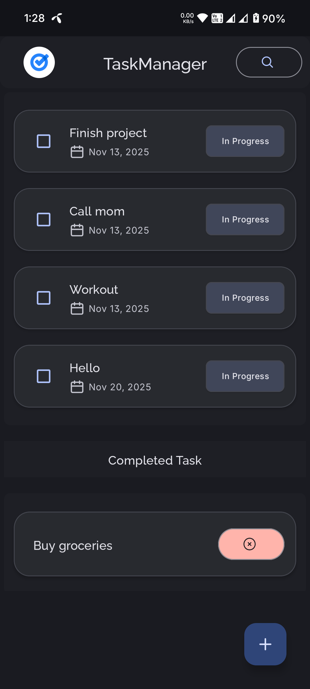
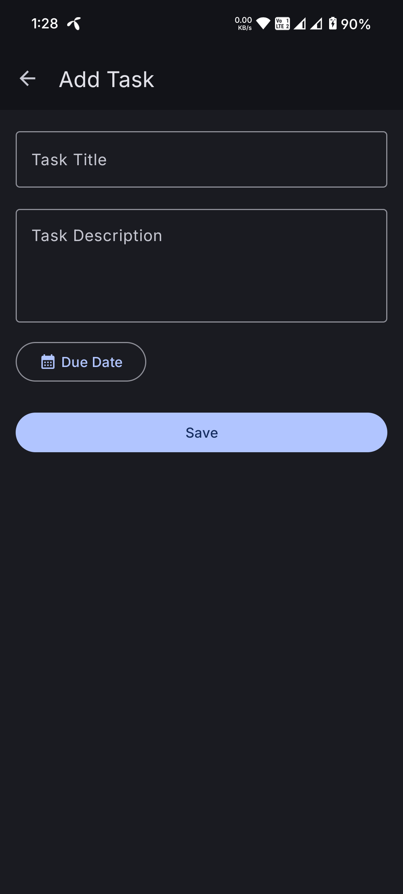
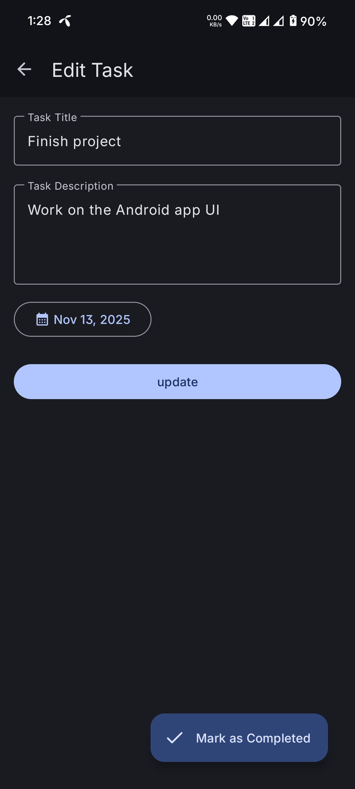
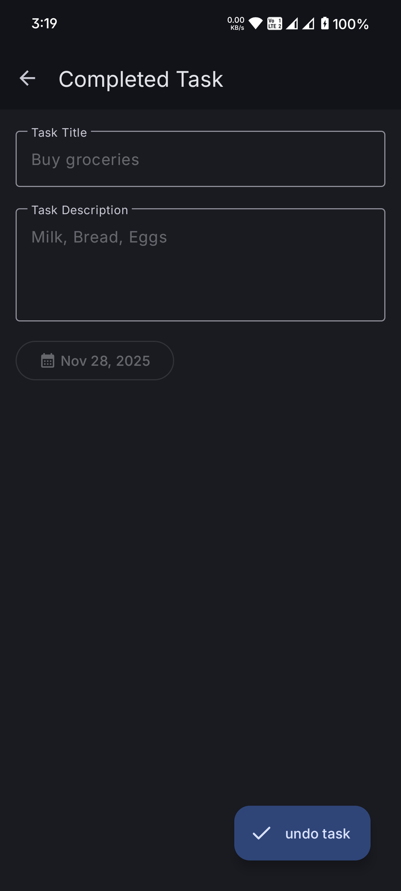
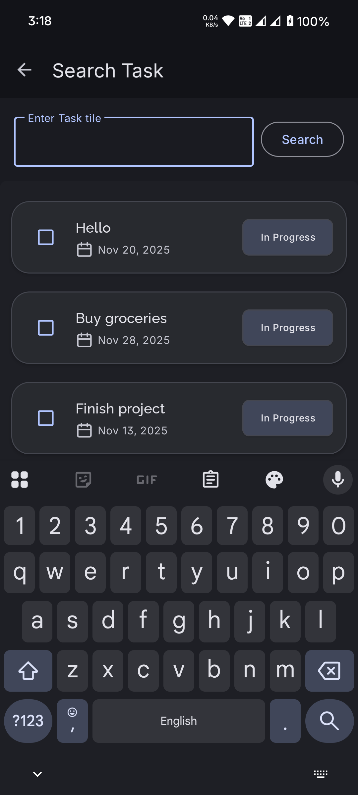

<div align="center">
  
  <h1>Task Manager</h1>
  <p>
    A simple and intuitive task management application for Android to help you stay organized and productive.
  </p>

<!-- Badges -->
<p>
  <a href="https://opensource.org/licenses/MIT">
    
  </a>
  <a href="https://github.com/NazrulIslam314/task-manager/issues">
    
  </a>
  <a href="https://github.com/NazrulIslam314/task-manager/stargazers">
    
  </a>
</p>
</div>

## ✨ Features

- **Create and Manage Tasks:** Easily add, edit, and delete your tasks with a simple and intuitive interface.
- **Set Due Dates:** Assign due dates to your tasks to keep track of deadlines and prioritize your work.
- **Mark as Complete:** Mark tasks as completed to track your progress and get a sense of accomplishment.
- **Clean & Modern UI:** A user-friendly interface designed with Material You components for a seamless and modern experience.
- **Persistent Storage:** Tasks are saved locally on your device using Room database, so you don't lose your data.

## 📸 Screenshots

| Home Screen | Add Task | Edit Task | Task Details | Search |
| :---: | :---: | :---: | :---: | :---: |
|  |  |  |  |  |

## 🛠️ Technologies Used

- **Kotlin:** The official programming language for Android development.
- **XML:** For designing the user interface layouts.
- **Material Components for Android:** To implement Material Design.
- **Android Jetpack:**
  - **View Binding:** To easily write code that interacts with views.
  - **Navigation Component:** To handle in-app navigation.
  - **Room:** For local database storage.
- **Coroutines:** For asynchronous programming.
- **SDP & SSP:** For supporting multiple screen sizes.

## 🚀 Installation

1. **Clone the repository:**
   ```bash
   git clone https://github.com/NazrulIslam314/TaskMeneger.git
   ```
2. **Open in Android Studio:**
   - Open Android Studio.
   - Click on `File > Open` and select the cloned project directory.
3. **Build and Run:**
   - Let Android Studio sync the project and download dependencies.
   - Click on the `Run` button (or `Shift + F10`) to build and run the application on an emulator or a physical device.

## 📝 Usage

- Launch the app to see your list of tasks.
- Tap the `+` button to add a new task.
- Tap on any task to view or edit its details.
- Use the checkbox to mark a task as complete.

## 📂 Project Structure

```
.
├── app
│   ├── src
│   │   ├── main
│   │   │   ├── java
│   │   │   │   └── com/nazulislam/taskmeneger
│   │   │   │       ├── adapter      # Adapter
                    ├── data      # Room database, entities, and DAO
│   │   │   │       ├── presentation # UI layer (Activities, Fragments, ViewModels)
│   │   │   │       └── utils     # Utility classes
│   │   │   ├── res 
            └── manifests
│   │   │       └── AndroidManifest.xml
│   └── build.gradle.kts
└── build.gradle.kts
```

## 🤝 Contributing

Contributions are welcome! If you have any ideas, suggestions, or bug reports, please open an issue or submit a pull request.

## 📬 Contact

Nazrul Islam – [nazrulislam3144@gmail.com]

